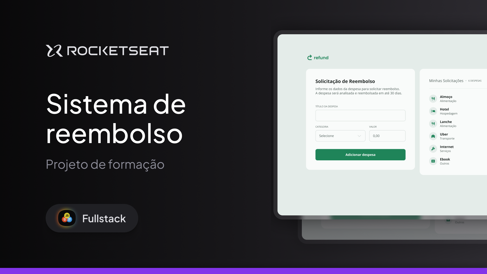

# Refund - Formulário de Reembolso

  

O **Refund** é uma aplicação simples para **gerenciar solicitações de reembolso de despesas**.  
Foi desenvolvido como parte do curso **Fullstack da Rocketseat**, com o objetivo de praticar a **manipulação do DOM** e consolidar conceitos essenciais de **JavaScript**.

---

## 🎯 Objetivo do Projeto

O foco principal do Refund é a prática e o aprimoramento das seguintes habilidades:

- **Manipulação do DOM** → Adicionar, remover e atualizar elementos HTML dinamicamente.
- **Gerenciamento de Eventos** → Utilização de _event listeners_ para submissão de formulários e cliques.
- **Lógica de Negócios** → Implementação da lógica para adicionar despesas, calcular totais e formatar valores.
- **Validação e Tratamento de Dados** → Entrada do usuário validada e formatação para padrão monetário brasileiro.

---

## 💻 Tecnologias Utilizadas

- **HTML5** → Estrutura do formulário e exibição das despesas.
- **CSS3** → Estilização da interface com design limpo e moderno.
- **JavaScript (ES6+)** → Lógica da aplicação: captura de dados, atualização dinâmica da lista e cálculo do total.

---

## ✨ Funcionalidades

- **Adicionar Despesa** → Preencha nome, categoria e valor para incluir na lista.
- **Remover Despesa** → Ícone de lixeira permite excluir qualquer item.
- **Cálculo Total** → Soma automaticamente o valor de todas as despesas.
- **Formatação Automática** → Campo de valor ajustado para moeda brasileira (_R$_).
- **Exibição Dinâmica** → Lista e total atualizados em tempo real.

---

### 👨‍💻 Autor

Desenvolvido por Wigor.  
Projeto fictício com fins educacionais.
